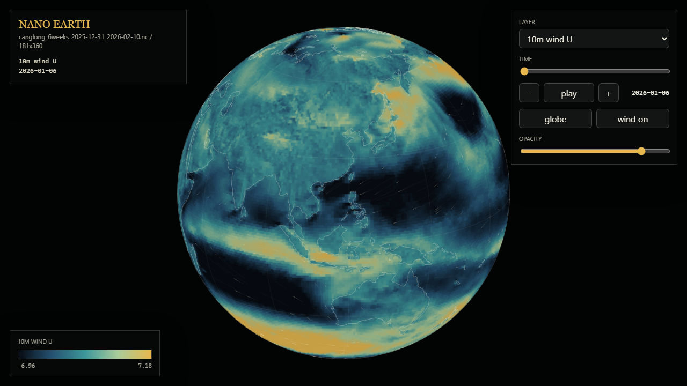

<p align="center">
  
</p>


<h1 align="center">Nano Earth</h1>

<p align="center">
  A lightweight local NetCDF weather-field viewer for ERA5-like datasets.
</p>

<p align="center">
  
  
  
  
</p>

<p align="center">
  
</p>

Nano Earth 是一个本地 NetCDF / ERA5 类气象数据浏览器。它参考了 earth.nullschool.net 的交互方式：全屏地球、色彩图层、风场粒子、时间切换和变量菜单，但前端渲染、数据结构和样式都是本项目独立实现。

当前版本读取 `canglong_allvars_2026-04-30_2026-06-10.nc`，把 GB 级 NC 文件预处理成浏览器可快速加载的小型二进制网格，并在网页中展示 26 个地面变量、10 个高空变量、5 个气压层和完整 6 周时间片。

## Features

- Full-screen weather-field globe with drag rotation and wheel zoom.
- Variable switching for surface and upper-air ERA5-like scalar fields.
- Time slider, step controls, and playback.
- Six-week forecast rail from 2026-04-30 to 2026-06-10.
- Animated wind particles from surface or matched upper-air U/V wind components.
- Globe and plate projection modes.
- Color legends and mouse-position readouts.
- TopoJSON coastlines and graticule overlay.
- Browser data pipeline for large NetCDF files.
- Pressure-layer export and selection for upper-air variables.
- No frontend build step required.

## Quick Start

If `public/data` already exists, start a local static server:

```powershell
python -m http.server 8000 -d public
```

Open:

```text
http://localhost:8000
```

If port `8000` is occupied:

```powershell
python -m http.server 8001 -d public
```

## Regenerate Data

The browser does not read the raw `.nc` file directly. Convert it first:

```powershell
python scripts/preprocess_nc.py canglong_allvars_2026-04-30_2026-06-10.nc --out public/data
```

Default resolution reduction:

```text
latitude step  = 4
longitude step = 4
```

For the current dataset, the original `721 x 1440` grid becomes `181 x 360`.

Use a finer output grid when you want sharper rendering:

```powershell
python scripts/preprocess_nc.py canglong_allvars_2026-04-30_2026-06-10.nc --out public/data --lat-step 2 --lon-step 2
```

Lower step values produce larger `.bin` files and higher browser rendering cost.

## GitHub Upload Notes

Do not commit raw NetCDF files to GitHub. The included `.gitignore` ignores `*.nc`, `*.nc4`, `*.grib`, and `*.grib2` because these files can easily exceed GitHub's file-size limits.

Recommended options for large datasets:

- Store raw NC files outside the repository.
- Publish sample data through GitHub Releases if the file size is acceptable.
- Use object storage, institutional storage, or a data portal for large datasets.
- Commit only small generated samples under `public/data` when you want the demo to run immediately after clone.

## How It Works

The data flow is intentionally simple:

```text
NetCDF file
  -> scripts/preprocess_nc.py
  -> public/data/manifest.json
  -> public/data/fields/<variable>/lXX_tXX.bin
  -> public/app.js
  -> Canvas globe
```

`scripts/preprocess_nc.py` uses `xarray` to open the NC file and discovers variables containing:

```text
time, latitude, longitude
```

Each `variable + layer + time` slice is exported as a little-endian `Float32Array` binary file. The browser loads `manifest.json`, fetches only the selected binary field, and renders it with Canvas 2D.

Wind particles use the vector pair that matches the selected field domain:

```text
surface fields -> 10m_u_component_of_wind + 10m_v_component_of_wind
upper-air fields -> upper_u_component_of_wind + upper_v_component_of_wind at the selected pressure layer
```

## Tech Stack

- Data processing: Python, xarray, numpy
- Input format: NetCDF
- Browser data format: `manifest.json` + binary `Float32Array`
- Frontend: HTML, CSS, vanilla JavaScript
- Rendering: Canvas 2D
- Coastlines: TopoJSON
- Local server: Python static HTTP server

The project does not currently use React, Vue, Vite, WebGL, or a backend server. That keeps the repository small and easy to run locally.

## Project Structure

```text
nano-earth/
  canglong_allvars_2026-04-30_2026-06-10.nc
  README.md
  AGENTS.md
  docs/
    assets/
      nano-earth-icon-sketch-globe-v2.png
      nano-earth-icon-sketch-tiles-v2.png
      nano-earth-icon-sketch-notes-v2.png
      nano-earth-preview.png
  scripts/
    preprocess_nc.py
  public/
    index.html
    styles.css
    app.js
    data/
      manifest.json
      land-110m.json
      fields/
        <variable>/
          l00_t00.bin
          l00_t01.bin
```

`public/data/fields` is generated output. Do not manually edit the `.bin` files.

## Current Dataset

The current generated browser data comes from `canglong_allvars_2026-04-30_2026-06-10.nc` and contains six forecast windows:

```text
2026-04-30 to 2026-05-06
2026-05-07 to 2026-05-13
2026-05-14 to 2026-05-20
2026-05-21 to 2026-05-27
2026-05-28 to 2026-06-03
2026-06-04 to 2026-06-10
```

The generated manifest currently contains 36 variables: 26 surface variables and 10 upper-air variables. Upper-air variables are exported at:

```text
200 hPa
300 hPa
500 hPa
700 hPa
850 hPa
```

Main variables include:

```text
10m_u_component_of_wind
10m_v_component_of_wind
upper_u_component_of_wind
upper_v_component_of_wind
upper_temperature
upper_geopotential
upper_specific_humidity
2m_temperature
2m_dewpoint_temperature
total_precipitation
total_cloud_cover
surface_pressure
mean_sea_level_pressure
sea_surface_temperature
sea_ice_cover
volumetric_soil_water_layer
```

## Adding Variables

Most variables are discovered automatically if they include `time`, `latitude`, and `longitude`.

For better labels and color palettes, edit `VARIABLE_LABELS` in `scripts/preprocess_nc.py`:

```python
VARIABLE_LABELS = {
    "2m_temperature": ("2m temperature", "temperature"),
    "total_precipitation": ("Total precipitation", "rain"),
}
```

The second value is the palette family. Current families:

```text
temperature, rain, pressure, wind, cloud, ice, flux, soil, radiation, scalar
```

If a variable is not listed, it will still be exported with an auto-generated label and the `scalar` palette.

## Customizing The Viewer

Common extension points:

- Unit formatting: edit `formatValue()` in `public/app.js`.
- Color ramps: edit `palettes` in `public/app.js`.
- New controls: edit `public/index.html`, bind events in `public/app.js`, style in `public/styles.css`.
- More coastline detail: replace `public/data/land-110m.json` with a compatible TopoJSON file.
- More vector fields: generalize the current U/V wind pairing in `public/app.js`.
- WebGL rendering: keep the preprocessing pipeline and replace the Canvas 2D renderer.

## Validation

Run syntax checks:

```powershell
python -m py_compile scripts/preprocess_nc.py
node --check public/app.js
```

Run the server and verify static assets:

```powershell
Invoke-WebRequest -Uri http://localhost:8000/ -UseBasicParsing
Invoke-WebRequest -Uri http://localhost:8000/data/manifest.json -UseBasicParsing
```

Optional visual check with Playwright:

```powershell
npx --yes playwright screenshot --wait-for-timeout=3000 http://localhost:8000/ .\docs\assets\nano-earth-preview.png
```

## Roadmap

- Use NC `units` and `standard_name` metadata for better labels and formatting.
- Add configurable vector-field pairs beyond 10m wind.
- Add user-selectable color palettes.
- Add high-resolution export for screenshots.
- Add WebGL rendering for larger grids.
- Add support for loading multiple NC-derived manifests.

## Notes

Nano Earth is designed for local data exploration. It is not a direct copy of earth.nullschool.net and does not bundle that site's assets. The current implementation borrows the broad interaction idea of a globe-based weather viewer while using an independent data pipeline and renderer.
